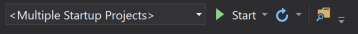
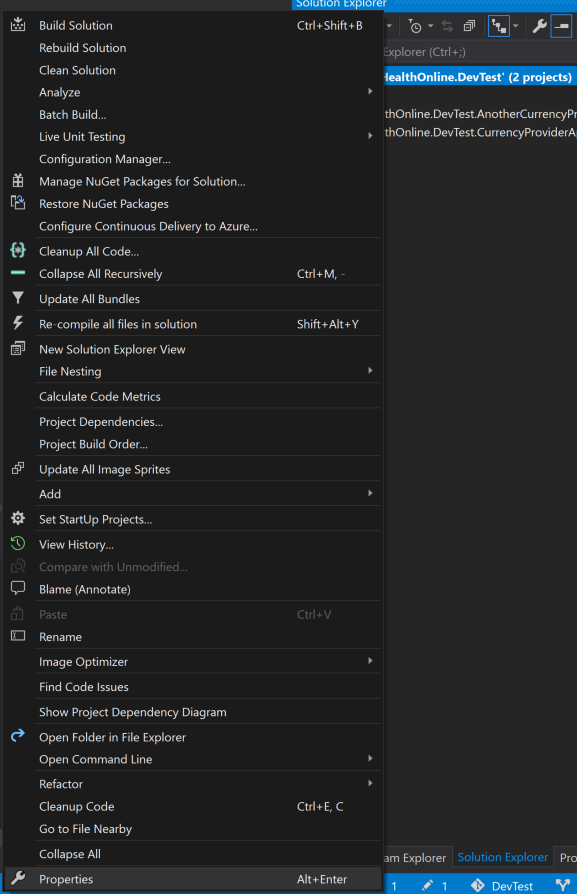
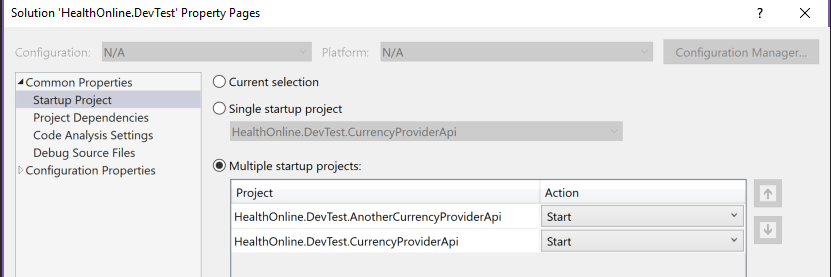
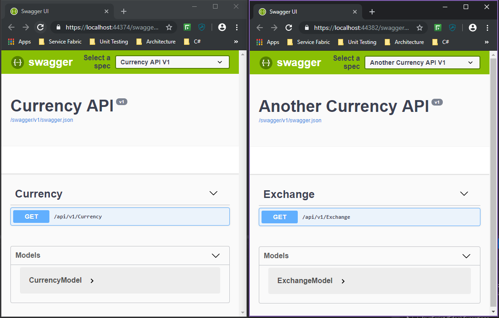

# Developer Test
Technical test for prospective developers.

## Overview
We are currently updating to use .NET Core 2.x for our API's and have a variety if frontend solutions. 

## Task
Using the given code base; that provides some fake currency API's; complete the following user stories:

As a User, I want to be able to see the currency rates from multiple providers

As a User, I want to be able to convert between currencies and display the result for each provider

As a User, I want to be able to enter a value and pick which currency to convert from and to

As a User, I want to see the average conversion rate across the providers

As a system, I want to be able to easily extend the providers used to give currency rates

### Application
Create an application using your choice of technology to interact with the given API. The application could be a mobile app, a website, a console application etc..

You must also demonstrate:
 - Use of Design Patterns
 - SOLID Principles
 - Unit testing
 - YOUR CODE MUST COMPILE

The task should not take too long to complete, perhaps a few hours, but you can spend as much time as you like. Once you are happy you have met the requirements please include a readme about what you would change, what features you might add or what refactoring would you do, etc..

__Note__: The code solution was created using Visual Studio 2017 and .NET Core 2.2.104

## Getting Started
1. Download a copy of Visual Studio from https://visualstudio.microsoft.com/vs/ and .NET Core from https://dotnet.microsoft.com/download/dotnet-core/2.2

2. Open solution in Visual Studio and make sure that multiple start up projects is configured. (if configured skip to step 5)

3. If this is not set up then right click on the solution and select properties

4. Make sure Multiple startup project is selected and each of the API's are set to start

5. Now you should be able to build and run the code. Once started two swagger pages should open

6. You can now start coding against these API's
